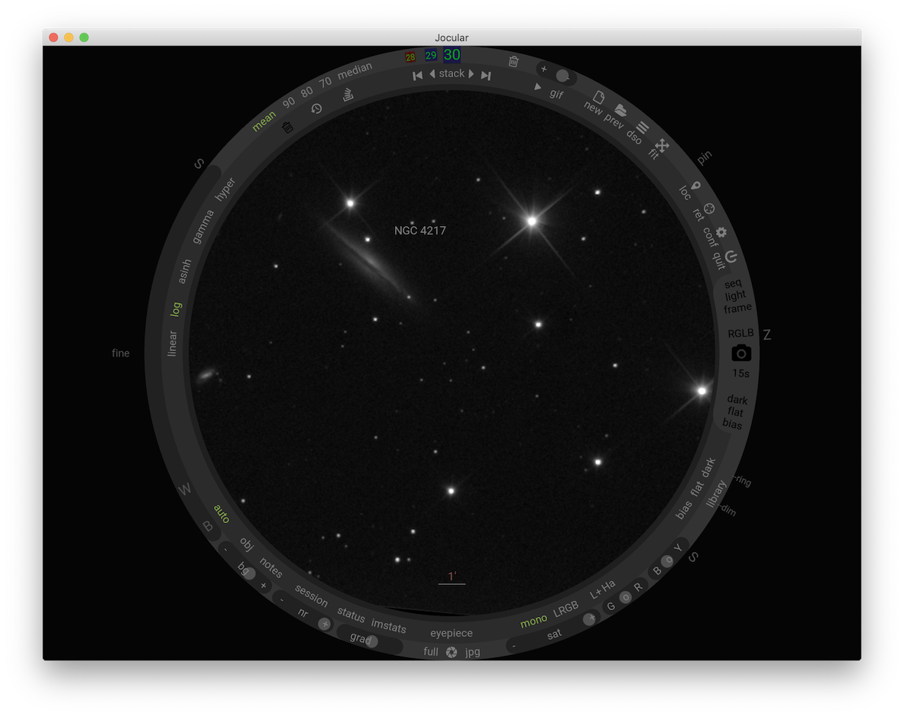

# Jocular

Jocular is a tool for **Electronically-Assisted Visual Astronomy** (EEVA).

Jocular supports the observation of astronomical objects in near real-time by connecting up a camera to a telescope or suitable lens. It also supports session-planning through extensive deep sky object (DSO) databases, helps to manage your captures, and
enables the reloading of previously-captured images.

Jocular is a cross-platform application and has been used extensively on OSX and Windows but ought to work on Linux variants too. 

To see some of Jocular's capabilities, visit the EEVA section of https://stargazerslounge.org, an amateur astronomy forum.

### Installation

Jocular requires a recent Python 3 system. To check whether you already have a suitable system, open a command window (Windows) or terminal (OSX/Linux) and type

```sh
python --version
```

If the version is 3.4 or later you are all ready to install Jocular. If not, visit https://python.org to download a version appropriate for your operating system.

Once you have Python installed, type the following in the terminal:

```sh
pip install jocular
```

This will install Jocular and its dependencies. The process may take a minute or more.

### Running

To test whether you can run Jocular, simply type

```sh
jocular
```

The first time Jocular runs it will ask you to supply a *data directory*. This is the place where Jocular will store all your captures, calibration files, observing lists and the like. The directory must exist so go ahead and create a directory wherever you like, named however you wish e.g. `joculardata`. Then run 

```sh
jocular --datadir <PATH>
```

where `<PATH>` is the location of your datadir. There is no need to supply the datadir on subsequent runs unless you change the location of your data directory.

Jocular's first-time startup is slow due to script compilation. It may take 10-30s to see a window like the one above, then another 10-30s to complete the loading. Subsequent runs are much faster (1-2 seconds). To see this, once Jocular has finished loading, close the window and type `jocular` again.

### Additional data files ###

In order to make best use of Jocular, you should download a set of DSO catalogues which collectively contain over 40000 objects of potential interest. Download this <a href="./assets/zips/catalogues.zip">zip file (<1M)</a>, unzip it and move the resulting directory called `catalogues` to your jocular data directory. When you next start Jocular, clicking on the `DSOS` icon will bring up the DSO database browser.

### If things go wrong

If you come across a problem and Jocular is still running, click on the status toggle at about 7 o'clock on the ring. This will bring up a panel in the lower right corner showing some information about each of the main components.

If this doesn't help, quit Jocular and re-run with the debug option:

```sh
jocular --log debug
```

This will output useful diagnostic information which might help to identify the problem.

### Known issues

There is currently an intermittent and hard to trace bug that appears to freeze the GUI. This occurs on one run in 20 or so. In fact, the GUI is not frozen but responds to double-clicks! However, this rapidly gets tedious so the solution is to quit and start again. Since this bug only ever occurs at startup this workaround is adequate for now.

## In the pipeline ##

Jocular is under active development (and use) so expect to see some additional functionality added in the coming months. Two hot areas are

- [ ] integration with INDI and perhaps ASCOM
- [ ] direct control of the mount (goto object button)
- [ ] asteroid identification
- [ ] simple photometry 


