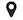
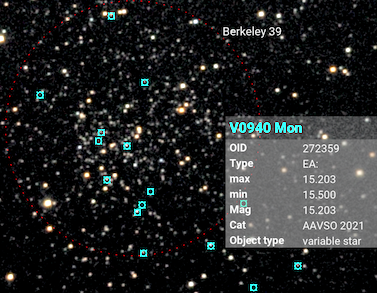
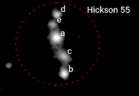

# Labelling objects in the image

Jocular can annotate images automatically, allowing you to see what objects are present and what astrophysical properties they possess. 


## Platesolving

Before an image can be annotated, it needs to be **platesolved**, which means finding out what part of the celestial sphere your image corresponds to. 

To set up platesolving, you need to download the [stellar database (94M)](https://transpy.eu.pythonanywhere.com/jocular/star_tiles.npz.zip), unzip it and place it in a directory called `platesolving` within your Jocular data directory.

Jocular also needs to knows the approximate focal length of your telescope (including any reducers/Barlows)  and the approximate pixel height of your sensor, and whether you are using binning. These values are set using the Plate-solving configuration panel. 

:::{note}
Jocular will try to get some of this information from the FITS header. 
:::

Platesolving in Jocular is not *blind*, but requires you to enter the name of the DSO being viewed (specifically, it needs the RA/Dec coordinates, but most of the time Jocular will supply these given the object name).

Finally, you should ensure that your image is [flipped](flips) such that there is some rotation that will produce North up and East to the left (ie matching a chart view). 

To perform a platesolve, click the  icon. If the solve is successful, the image will be rotated with North upwards and the field of view in degrees will appear in the status panel (lower left).

Failures are rare: if you encounter one, check the steps above and consider the possibility that the object is not in the current image.

## Annotation

Once an image has been platesolved, it can be annotated by moving the slider (initially labelled 'off') in the upper-right quadrant. Moving the slider upwards the label changes to `fov` (a field of view size indicator appears at the base of the image), then `pin` (displays anything you decided to pin). Moving still further the slider label changes to a numeric magnitude value which acts as a limit on what is displayed. 



Objects are displayed as coloured squares, with different colours indicating different object types. Hovering the mouse above a square brings up information about the object. Clicking on the square ‘pins’ the object name. Clicking again ‘unpins’ the object. In this way, you can select just those objects you wish to annotate (e.g. to include them in a snapshot). The target DSO is pinned by default, though you can unpin it.

:::{note}
Currently, annotation labels are included in snapshots taken in `eyepiece` mode but not in `landscape` mode.
:::

At the extreme of its range, the slider displays group members e.g. individual members of a Shakhkbazian or Hickson group. The figure shows the result of displaying the members of Hickson 55 (first by moving the slider to the extreme value, then clicking each square, then moving the slider to the pin position).



Labels can be clicked and dragged to reposition them, if necessary.

```{admonition} Beware!
:class: warning
Platesolving resets everything i.e. anything pinned or the positions of labels that you have moved will be lost. The same is true when you reload a previous capture.
```

## Deep catalogues for annotation

By default, image annotation uses the DSO catalogues supplied with Jocular. These are not very deep (only tens of thousands of objects), yet it is likely that your images contain far more interesting objects. To see them, you will need to download further catalogues and place the unzipped file (with `.npz extension`) in the `catalogues` subdirectory of your Jocular data directory

* 3 million galaxies [(92M)](https://transpy.eu.pythonanywhere.com/jocular/Hyperleda.npz.zip) from [*Hyperleda*](http://leda.univ-lyon1.fr/)
* 2 million variable stars [(61M)](https://transpy.eu.pythonanywhere.com/jocular/vS.npz.zip) from the [*AAVSO*](https://www.aavso.org/)
* 153k multiple stars [(7M)](https://transpy.eu.pythonanywhere.com/jocular/WDS.npz.zip) from the [*WDS*](https://heasarc.gsfc.nasa.gov/W3Browse/all/wds.html) 
* 1.5 million quasars [(42M)](https://transpy.eu.pythonanywhere.com/jocular/milliquas.npz.zip) from [*Milliquas*](https://heasarc.gsfc.nasa.gov/W3Browse/all/milliquas.html) 
* 860k stars [(15M)](https://transpy.eu.pythonanywhere.com/jocular/SkiffSpectralClasses.npz.zip) from the [*Catalogue of Stellar Spectral Classifications*](http://vizier.u-strasbg.fr/viz-bin/VizieR?-source=B/mk)
* 118k stars [(16M)](https://transpy.eu.pythonanywhere.com/jocular/XHIP.npz.zip) from the [*Extended Hipparcos Catalogue*](https://vizier.u-strasbg.fr/viz-bin/VizieR?-source=V/137D)
* Compact galaxy group members [(0.1M)](https://transpy.eu.pythonanywhere.com/jocular/members.npz.zip) from various sources

Download as many or as few as you wish -- Jocular will operate with all, some or none. You can control which ones Jocular uses dynamically via the `Catalogues` panel of settings.

:::{note}
In some parts of the sky (e.g. M42) there are thousands of variable stars to annotate. This can slow things down considerably, so you might want to temporarily switch off the VS catalogue.
:::

When annotating, Jocular first queries the ‘standard’ catalogues (the ones that are visualised in the DSO browser), then looks for any deep catalogues. On encountering two objects with the same name and object type, the deep catalogue takes precedence (normally this contains richer information).

:::{note}
It is not easy to add your own annotation catalogues since the deep catalogues employ a custom format that make them very fast to use in spite of millions of members in some cases. However, if there are any catalogues you'd like to see included, or if you're a Python programmer and wish to know more about the format, let me know by PM to Martin Meredith on [Stargazers Lounge](https://stargazerslounge.com).
:::
