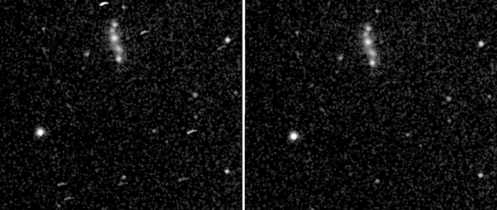
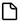

# Calibration and hot pixel removal

Electronically-enhanced visual astronomy is not as concerned with image quality as astrophotography -- after all, the goal is to observe -- but some cleaning up processes can be applied automatically, with little or no effort.

## Bad pixel removal

Perhaps the most intrusive artefacts while observing are caused by those pixels that are essentially dead, stuck at a high or low value, or bright pixels that tend to proliferate on hotter nights. While they may not stand out on a single sub, when stacking multiple subs these pixels (especially the bright ones) create little trails across the image due to image translation and rotation applied during image registration. 

Traditionally, bad pixels are removed using [darks](darks). However, if you don't have any darks handy, or don't want the bother of collecting darks, it is quite easy to remove them in Jocular. Simply turn hot pixel removal on in the `Bad pixel map` settings panel (it will be on by default).

It can be informative to switch bad pixel mapping off and recompute the stack by clicking the  icon. Any hot pixels will become visible. Indeed, their track provides a record of mount tracking so you may be able to diagnose tracking issues by observing hot pixels.

The image below shows bad pixel removal off (left) and on (right).

.

## Deploying darks and flats

Assuming you have already collected calibration frames (either using Jocular, as described below, or using a different source), it is very easy to use them. Simply toggle the buttons marked `dark` and/or `flat` in the lower-right quadrant of the interface. Jocular will then apply any suitable calibration frames it can find in your calibration library. Whether Jocular is able to calibrate depends on several factors (see next para); Jocular reports the outcome in the status panel (lower left). 

If you wish to un-apply calibration frames, simply click the button again and perform a recompute .

Asking for your incoming subs to be calibrated is one thing, but of course it requires a suitable master calibration frame to exist in your library. Jocular first identifies any suitable candidates and then looks for the best match. For example, darks need to be within a specified exposure and temperature tolerance, and for cameras with user-settable gain/offset these values must match exactly. Check out the `Calibration` settings to explore the kinds of factors at play. 

:::{note}
Jocular also calibrates subs which correspond to a sub-region of a master frame i.e. subs collected with ROI set.
:::

(darks)=
## Collecting calibration frames with Jocular

Assuming Jocular is controlling your camera directly (if not, see [watched mode calibration](watchedmodecalibration) below), calibration frames are collected using one of the four calibration scripts that appear when you click the name above the camera icon . The options are `dark`, `flat`, `bias` and `autoflat`.

The capture process is almost identical to collecting normal `light` frames (i.e. click the camera to start/stop), with just a couple of differences:

* when saving (i.e., when clicking on the new object  icon), you will be asked if you wish to save a master calibration frame (the answer is normally yes!)
* the default method for stack combination is `80%` rather than `mean` when you are collecting flats (however, you can change the stack combination method and Jocular will use your choice when saving the calibration frame)

Since collecting calibration frames is pretty much the same as collecting lights, this means that all the individual subs are saved, subs can be selected or deselected, and the object (we can't really call it a DSO) can be reloaded in the future and perhaps further edited/refined (whenever you reload a calibration object you'll be asked if you want to save a master).

To take an example scenario, suppose you collect some darks but forget to cap the scope and only realise this some subs into the capture. Just deselect those subs and Jocular will ignore them when creating the master dark. 

### Specifics for darks

It is really important to supply a temperature value if Jocular cannot read it directly from the sensor. Saving a dark frame without temperature information limits its usefulness. Temperature-less darks can still be deployed within the current session, since it is assumed that the temperature won't have changed much.

### Specifics for flats

A master flat will only be produced if the flat itself is calibrated. This (quasi-draconian?) requirement avoids many of the issues that arise when flats are deployed. If Jocular cannot calibrate the flat itself, a message appears to warn that the master flat is not generated. However, all is not lost! The flat subs can be reloaded at any point in the future when it is possible to calibrate them (see below), at on saving a master flat will be produced.

What is involved in calibrating flats? Essentially, it is necessary to subtract either a master bias from each flat sub, or to subtract a so called master flat-dark (also known as dark-flat). A third option, to subtract a constant value, is also possible. The choice of which to use is available in the `Calibrator` settings. If you choose `bias`, for a flat sub to be properly calibrated you should ensure that you have previously collected a master bias (e.g. using the `bias` script). Likewise, for flat-darks it is necessary to have a master dark within a certain exposure of that used for the flats. An option is available to set this tolerance. 

The best policy on obtaining a new camera is to create a good quality master bias (i.e. made up of a large numbr of subs); this is very quick to do and once the master is saved and in the library it will be applied silently to your flat subs.

(calibrationlibrary)=
## Your calibration library

Jocular maintains a library of all your calibration masters so that it can deploy them effortlessly. you can inspect (and maintain) the library by clicking on the  icon next to the `dark` and `flat` toggles on the eyepiece ring. In fact, the calibration library is simply a view on to the `calibration` subdirectory of your joculardata directory.

(watchedmodecalibration)=
## Collecting calibration frames in watched mode

If you are using a separate capture program, you can still collect calibration frames by ensuring that the capture program writes appropriate information into the FITS header, or, failing that, that the names of the subs start with `flat_`, `dark_` or `bias_`.

:::{note}
Using the watched camera method to collect calibration frames is not guaranteed to work since different capture programs use different FITS headers to identify the type of sub. If in doubt, contact me, preferably with an example FITS, so that I can add the necessary header handling into Jocular. One approach that ought to work as a last resort is to set the `sub_type` value to `from user` in the `watched dir` device configuration screen, and then choose `dark`, `flat` or `bias` on the button above the camera icon before your subs start to arrive in the watched directory.
:::

## Adding calibration masters to the library directly

While it is possible to add calibration masters manually to the `calibration` directory, a better option is to set Jocular into `watched` mode and place the calibration master into the watched directory. Jocular will then perform some checks before automatically adding the master to the calibration library.

:::{note}
Depending on the capture program used to collect the master, Jocular may or may not be able to work out that it is dealing with a master calibration frame.
:::

