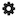
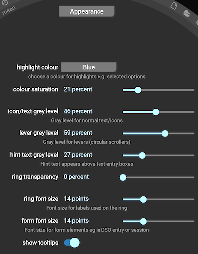

# Configuration options

Many options can be modified via the set of configuration panels that are accessed using the  icon. Clicking brings up the last used configuration panel e.g. this is the panel that controls aspects of Jocular's appearance:

(config)=

Select the relevant panel using the dropdown menu at the top.

As with all the panels that appear in the centre of the eyepiece, the configuration panel is closed simply by moving the mouse out of the eyepiece ring.

## Initial configuration

There are a few settings that you are encouraged to configure at the outset.

1. **Appearance**

The `Appearance` panel (shown above), controls varies settings to customise the look of the interface. While these are mainly down to personal taste, you might find it worth altering the font size controls if you find that the existing settings lead to icons/text that are too cramped, or unreadably small.

(latlongconfig)=
2. **Observatory**

This panel allows you to set your longitude and latitude, the values of which are used in the [DSO planner](dsoplanner.md) to to compute altitude and azimuth of of DSOs at your location. 

(flips)=
3. **View**

Under the `View` panel, the first two options control how the image from your sensor is flipped horizontall and vertically prior to being displayed. The aim is to flip the image so that it is possible to rotate it to match the view of the sky on star charts. Although optional, doing so is generally helpful for object identification, and in particular Jocular's [automatic object annotation](annotator.md) will only work if the image is correctly flipped.

Precisely what flips you need can be determined by experimentation or by consulting any astronomy primer that indicates how different types of scope/diagonal combinations affect the view. The settings shown below correspond to the flips I need to make for my Newtonian: 

