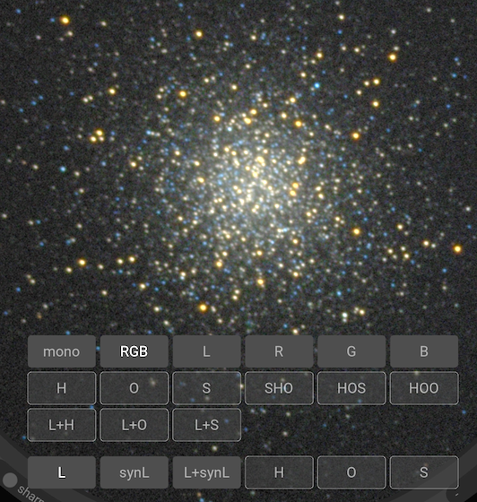
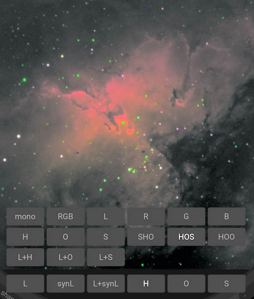
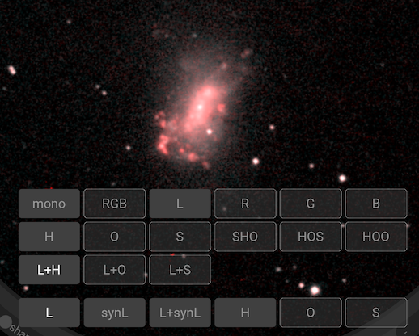
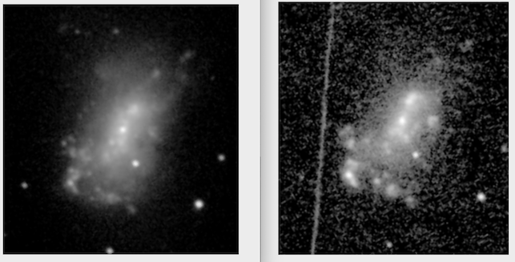

# Filters and colour

This section explores how Jocular can be used with multiple filters to synthesise colour images.

While Jocular does not support one-shot-colour cameras in any meaningful way (yet), it does support **multispectral** processing i.e. generation of coloured images from a sequence of monochrome-plus-filtered images. This approach can be used to create `LRGB` images as well as for the combination of narrowband filters e.g. `SHO`, `HOS`, `HRGB`.

Every monochrome sub that is either captured directly or otherwise received by Jocular has a `filter` property which indicates what filter was used during the capture. In the case of subs arriving in the watched directory, Jocular attempts to access this information from the FITS header, or failing that from the file name. Jocular can also read the filter information from the user if the appropriate `from user` option is set in the watched camera settings. The background colour of the sub number at the top of the eyepiece provides a visual indication of the filter used.

Once Jocular has a stack of subs with known filters for each one, on clicking the spectral mode button in the lower-right quadrant (initally set to `mono`), a menu containing all the possible filter combinations appears. Those that are highlighted are legal options given the subs that are currently on the stack.

Jocular's colour processing is based on **LAB** colour space, which separates the *chrominance* and *luminance* channels. The spectral model panel allows us to sspecify how we want our filters to map on to the two components separately. The upper rows indicate the ways in which the available channels are mapped on to chrominance, while the lower row indicates how to construct the luminance component. Changes take effect (almost) immediately, so exploration is encouraged! A few examples illustrate these concepts.

## Example 1: LRGB

We have `L`, `R`, `G` and `B` subs available in the image of *Messier 13* below, so have the option of viewing the DSO

* in `mono`, which uses all subs
* in `RGB` 
* by examining the stack made up of the individual filters `L`, `R`, `G` or `B` subs only. 

For the luminosity component, we can

* use the actual `L` data
* create a *synthetic luminance* (`synL`) from the RGB channels
* use the average of the `L` and `synL` components

## Example 2: Narrowband

The image of *Messier 16* (from user Steve) contains subs for all the narrow band channels `H` (H-alpha), `O` (O-iii) and `S` (S-ii) as well as `L`, `R`, `G` and `B`, so the palette of options in this case is full. Here, we've chosen the `HOS` palette i.e. mapping `H` to the red channel, `O` to green, and `S` to blue, and in addition to use the H-alpha signal for the luminance component, which has the effect of ensuring that the extensive H-alpha clouds are prominent. Don't expect realistic star colours!

## Example 3: Single narrowband layer

Jocular also supports a non-LAB mode which maps a single narrowband component to a separate layer from the luminosity component. This layer is then stretched and blended using the colour stretch and saturation sliders respectively (see below). The `L+H`, `L+O` and `L+S` options designate these processes.

The image below of the irregular galaxy *NGC 4449* contains luminosity (L) and H-alpha (H) subs. Here's we're viewing the `L+H` combination. Note that at present the luminosity component has to be the `L` channel itslf (ie the `synL` etc options are currently ignored).

We can also view the L (left) and H (right) contributions separately:

:::{note}
Currently, the narrowband layer is mapped on to red, regardless of whether it is `H`, `O` or `S`.
:::

## Colour manipulations

Jocular provides two controls on the main eyepiece ring to modify colour: `saturation` and `colour stretch`, labelled `sat` and `S` respectively. However, the underlying colour model separated luminosity (L) from chrominance, so all the normal luminosity controls (B/W/stretch etc) also affect the image displayed.

There are additional controls on the colour configuration panel, including the ability to alter the relative weights for the RGB channels. For instance, if you measured the weights using a nearby `G2V` class star, you can enter the weights here.

