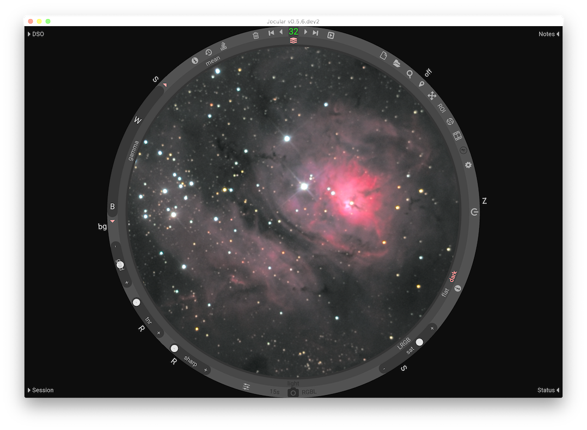

.. Jocular documentation master file, created by
   sphinx-quickstart on Wed May  4 21:54:55 2022.
   You can adapt this file completely to your liking, but it should at least
   contain the root `toctree` directive.

Welcome to Jocular!
===================================

**Jocular** is a tool that supports astronomical observing using a camera and telescope or lens.

Jocular's principal use is the observation of astronomical objects in near real-time by connecting a camera to a telescope or suitable lens. Jocular also supports session-planning through extensive deep sky object (DSO) databases, helps to manage your captures, enables the reloading of previously-captured images, and can be used to annotate your images.

The philosophy behind Jocular is to allow the user to focus on observing, by presenting a minimal, distraction-free interface and a recompute strategy that allows most decisions -- apart from where to point the scope -- to be reversed during the course of the observation itself.

.. image:: https://readthedocs.org/projects/jocular/badge/?version=latest
   :target: https://jocular.readthedocs.io/en/latest/?badge=latest
   :alt: Documentation Status

Indices and tables
==================

* :ref:`genindex`
* :ref:`modindex`
* :ref:`search`   

.. toctree::
   :maxdepth: 2
   :caption: Installing Jocular

   installation.md

.. toctree::
   :maxdepth: 2
   :caption: New users

   quickstart.md
   liveobservation.md
   session.md
   config.md

.. toctree::
   :maxdepth: 2
   :caption: In more depth

   dsoplanner.md
   annotator.md
   stretch.md

.. toctree::
   :maxdepth: 2
   :caption: Advanced features

   calibration.md
   catalogues.md
   filters.md
   
.. toctree::
   :maxdepth: 2
   :caption: Solving problems

   troubleshooting.md

.. toctree::
   :maxdepth: 2
   :caption: Acknowledgements

   thanks.md
   

