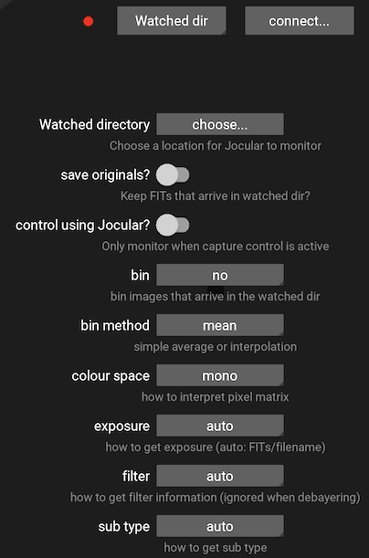

# Live observation

Although reloading and studying previous captures can be useful and informative, Jocular was designed primarily for live observing, so let's see how to use the program under the stars.

There are two ways to get your camera talking to Jocular:

1. **Direct mode** Jocular directly controls the camera
2. **Watched mode** A separate capture program dumps its subs into a place where Jocular can find them

Jocular remembers your choice of mode between sessions so if you are only ever going to use one mode, this is a once-only operation.

:::{admonition} Supported cameras
:class: warning

Jocular currently supports the ZWO ASI range of monochrome cameras as well as the Starlight Xpress Lodestar mono camera. If you wish to use a different camera you will have to use the watched mode.
:::

## Direct mode

In direct mode, Jocular connects to your camera and is able to set parameters (e.g., gain, exposure time, binning) and initiate captures. In this mode Jocular can be used for all aspects of capture, including the use of short exposures for framing, alignment and focusing.

Plug in your camera and select the devices menu using the telescope icon . Click on the camera type dropdown next to the red dot, select the desired camera type, then click connect. If Jocular successfully finds your camera, the red dot will turn green and you're ready to go!

The lower part of the devices panel allows you to set various capture parameters. You don't need to do this immediately, but can return to this screen whenever you like to changes things like gain and binning. Commonly-changed settings such as exposure are accessed directly from the Jocular interface as we'll see in a moment.

To start a capture click on the camera icon  at the base of the eyepiece view. The captured images will appear on the screen. Click the camera icon again to pause or stop the capture.

### Capture modes and exposure setting

Jocular currently supports 9 different capture modes, but most of the time you'll be using just two: 

1. `frame`: used for framing the image (perhaps with the help of platesolving to identify the DSO); these images are not saved or stacked

2. `light`: your 'main' captures that are saved and live-stacked as they arrive

To change from `frame` mode to `light` mode, click on the currently-displayed mode (in this case `frame`) that can be found just above the camera icon, and select `light` from the options that pop up. At the start of each new capture Jocular defaults to the `frame` mode.  

To set a suitable exposure for either mode, click on value representing the current exposure (to the left of the camera icon), and choose a new exposure value. This will then be used for that mode until you change it.

## Watched mode

In this mode, Jocular monitors a directory for incoming FITS files. As subs arrive, they are added to the stack as for direct camera control.

Watched mode is selected in the same way as choosing a directly-controlled camera, but instead of choosing a camera type, select `watched dir` and click connect (this checks that the directory exists and is readable).

If you don't specify it, Jocular looks for the watched directory within your `JocularData` directory, but you can change to whatever directory is most convenient.

Jocular needs to know about the type of sub (light, dark), whether it has been [filtered](filters.md) and its exposure time. Depending on the capture program you use, some or all of these will have been written into the FITS header. If this isn't the case you can tell Jocular how to get this information by choosing the appropriate option on the configuration panel:

(watched)=

One way to test watched mode without having a capture program active (e.g. during daylight hours) is to simply drop FITS files manually into the watched directory, and check that Jocular displays them. See [troubleshooting](troubleshooting.md) for what to check if things go wrong at this point.
