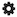
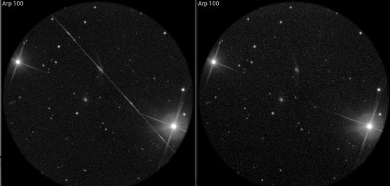
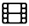
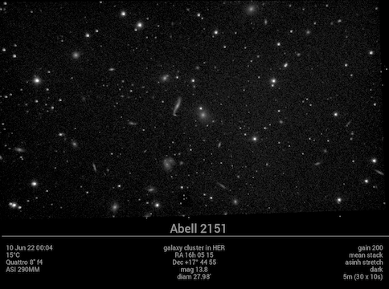
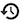

# Quick start

You can practise using Jocular using some example captures -- I've put a couple of DSOs at [this link (30M)](https://transpy.eu.pythonanywhere.com/jocular/examples.zip). 

Put the unzipped directory (called 'examples') in the `captures` directory of you jocular data directory, then start Jocular and click on  in the upper right quadrant to bring up a table of captures. This will initially be empty, so click `rebuild observations` at the bottom of the table and the two DSOs you've just added will be ready to load.

Loading is done by clicking on the DSO name. All the subs for that object will be loaded and aligned exactly as if you were observing live. 

:::{note}
Normally, you wouldn't go thru this procedure because Jocular organises all the DSOs you've captured with Jocular automatically so that they appear in the table. However, the procedure does serve to demonstrate how to include any of your own previous captures into Jocular. Place all the FITS for each DSO into its own directory (I suggest naming the directory for the DSO), and then add each DSO directory to any subdirectory of `captures` (e.g. you could use the `examples` directory, but it really doesn't matter). Then ask Jocular to rebuild observations and it will find them and make them available. Jocular organises its own captures by sessions and DSOs within sessions, which is why we have a two-level directory structure for captures.
:::

## Exploring the interface

Jocular's eyepiece-like view contains most of the controls needed in an observing session. To explore the interface, **turn tooltips on** by clicking the  icon to accesses Jocular's [settings system](config.md), choose `Appearance` from the dropdown at the top, and set `show tooltips` to `on`. Hovering over the various controls will now bring up a short description of what each control does.

The letter in square brackets at the end of certain tooltips indicates a keyboard shortcut that can be used for fine control. Shortcuts work by combining the key with `ctrl` (to increase the value) and `option` (to decrease the value). For example, `ctrl-z` increases the zoom level while `option-z` decreases it.

### Pan, zoom and rotate

The image can be moved by selecting and dragging near the centre of the image, zoomed in/out using the Z slider on the right, or rotated by selecting and dragging near the edge of the image. 

### Negative mode

Sometimes it is easier to see faint details when the image intensities are inverted, as in a photographic negative. Double click the image to show the negative view (double click again to return to the normal view)

### Viewing individual subs or the stack

The group of controls at the top of the eyepiece relate to **subs** and the **stack**. When Jocular loads a previous capture, it defaults to showing the individual subs as they come in. The number of the currently displayed sub is indicated at the top of the ring. To view the stack (i.e. the result of combining the individual subs after ensuring they are properly aligned), click on the sub/stack toggle  just below the number. Clicking again will return to the sub view. Jocular provides access to all the subs that make up an observation. Step through these using the arrow icons. There is also an option to animate the sequence of subs (or the stack as it builds up) using the  icon.

### Deselecting and deleting

You can **deselect** a sub (i.e. remove it from the stack) by clicking on the sub number. Deselection is useful for removing single subs that would otherwise ruin the image, as is the case for Arp 100 below which scored a direct hit from a satellite! The left image shows the stack; even though the satellite was present only on the first 2 subs of the stack, its influence is still clear after stacking a further 10 subs. The rightmost image shows the stack with the first two subs deselected.

(Arp100)=

:::{note}
There is an alternative (and often better) way to remove artefacts such as satellite trails. That is to use a different form of stack combination. The default is to take the average of all the subs in the stack at each pixel, but to remove outliers you can select to preserve just the middle value after sorting (the median), or to use the middle 70, 80 or 90% of subs after sorting. 
:::

Removing a sub by deselection does not delete it permanently; you can re-include the sub in the stack by clicking the number again. If you really do want to **delete a sub** -- perhaps because it is irrecoverably blurred -- then click the  icon . If Jocular is displaying subs, the sub will be deleted silently and the remaining subs renumbered. However, if a stack is displayed, Jocular will, by default, ask you to confirm that you really do wish to delete the entire stack of subs. There is an option to change this default behaviour in the [configuration system](config.md).

:::{admonition} Beware
:class: warning
1. It is not currently possible to delete the first sub in the stack.
2. The delete stack option only applies to live observations.
:::

Normally, the numbers you see for selected subs are in green. This indicates a successful alignment. If the sub is red, Jocular was unable to align it, and it is not included in the stack. Deselected subs are shown in grey.

:::{note}
If you are using [filters](filters.md), you'll see that the *background colour* of the number changes to indicate which filter was used to take the image.
:::

### Adjusting the image

The controls for modifying how the intensities are displayed are grouped in the upper-left quadrant of the eyepiece ring, and consist of

* **blackpoint** (B) and **whitepoint** (W) sliders
* a choice of [stretch functions](stretch.md) along with a slider (S) that controls the **degree of stretch**
* a control that allows more or less of the **background** (bg) to be displayed

Black and whitepoints can also be estimated automatically by clicking the arrows at the end of the groove where the B and W sliders reside.

:::{note}
It is recommended to leave automatic blackpoint detection and use the bg slider to fine-tune the blackpoint.
:::

Just below the blackpoint control you'll find a slider that handles simple **background gradient subtraction**. Jocular estimates the best 2D planar fit to the background and when the gradient slider is in the middle of the range it subtracts that estimate from the image. At the upper end of the slider no gradient subtraction occurs, while at the lower end double the estimate is subtracted, and usually it is possible to find a setting within this range that removes most of the gradient. 

The `tnr` slider applies **noise reduction** to the image ('TNR' stands for `Tony's Noise Reduction` -- see [thanks](thanks)). The `R` slider next to `tnr` controls one of the key parameters (radius) used in the noise reduction algorithm.

The `sharp` slider applies **sharpening** to the image. Again, the `R` slider controls its own radius parameter.

(snapshot)=
### Taking a snapshot

What better way to preserve an interesting observation than to take a quick snapshot! Simply click on the  icon. You can then select whether to 

* show a *landscape* view (as it would look directly off the sensor) or the view in the *eyepiece*, complete with any zooming and rotation of the image
* save a *plain* image, an image annotated with the object's *name*, or one which includes *full* details of the object, observing session etc
* save in *png*, *jpg* or *fits* format. There is also an option to create an *animated gif* of all the subs in the stack.

The snapshot is saved in the *snapshots* directory within your Jocular data directory.

The [Arp 100](Arp100) image above is an example of an eyepiece view with a name annotation while this shot of the galaxy group **Abell 2151** below is a full landscape view.

## Recomputing the stack

Jocular allows the stack to be recomputed following any change that could conceivably affect processing. For instance, if you make a change to some setting, it can be applied  immediately by clicking the  icon in the upper left quadrant. There is also a `shuffle` option  which differs from recompute in that it modifies the order of the subs prior to recomputation. Tip: If you runs into alignment issues, try clicking the `shuffle` icon (potentially several times) as this often solves the problem.

:::{note}
In fact, the order is not completely randomised; instead, a sub with low transmissibility is moved to the start of the stack. The reason for this approach is that Jocular computes a threshold for detecting a user-specified number of stars based on the first sub in the stack. If the first sub is a light sub, the threshold might be set too high for later subs that have a lower transmission (e.g. h-alpha subs). 
:::

