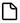

# A typical observing session

Most of the time we're going to observe multiple objects in a single session. A minimal observing session simply involves the repetition of these two steps;

1. Click the  icon to save any existing capture and start a new one
2. Collect `light` frames

We might also [name the object](namingobservation) and [take a snapshot](snapshot).

Jocular helps to keep things organised by making it easy to:

* provide names for DSOs
* record information about the observing conditions
* write observing notes

as well as automatically saving all the incoming subs and DSO metadata for later reloading and enjoyment.

Jocular also provides tools for [planning an observing session](dsoplanner.md).

## Naming your objects

Naming your current observation is useful if you want to save a labelled snapshot or for when you reload a previous observation. However, naming is optional: Jocular will still save your objects, and you can add a name at any point in the future.

(namingobservation)=
### Method 1: use the observation planner

There are several ways to provide a name. The simplest is to use the [dso planner](dsoplanner.md), accessed using the search icon . Clicking on any DSO in the name column is sufficient to provide a name for the current observation. This approach works especially well if you are working you way through an observing list you prepared in advance. 

To display the information about the DSO on the main interface, ensure that the DSO panel is displayed by clicking on the `DSO` label in the top left corner of the application. 

### Method 2: provide the name directly

Another way to name the object is to type the DSO name directly into the `name` field of the DSO information panel. 

If the name is one known to Jocular, the rest of the information (object type, constellation etc) will be filled in as you type. If the remaining fields are not filled in automatically, this may be an indication that Jocular cannot find the object, perhaps because it is a name you've invented or the name of an object such as a comet that Jocular doesn't know about, or it might indicate something else -- see the box below for how to resolve common issues.

:::{note}
* Naming is case-insensitive
* Use `Messier` rather than `M` for Messier objects
* Leave a space between the catalogue name (e.g. `Messier`, `NGC`, `IC`, `Berkeley`) and the number.
* Very occasionally, more than one object has the same name (e.g. `Abell 6` is a common designation for a planetary nebula and a galaxy group). To disambiguate, type the object type into the `type` field (use `pn` and `gg` respectively for the two aforementioned types).
:::

## Recording observing conditions

You might wish to provide some information about the current sky conditions e.g. seeing, transparency, brightness. Any information so recorded is saved alongside the object for when you reload the observation in the future, and some of it is added automatically to snapshots. The session information panel appears at the bottom left corner of the display, and can be toggled as for the DSO information panel.

This panel also allows you to identify the telescope and camera used for the observation. Anything you type in the `scope` and `camera` fields is persistent between observing sessions. 

:::{note}
At the present time, Jocular doesn't use the camera/scope information you type here in any meaningful way. Instead, sensor information is derived directly from the camera (if in direct mode) or FITS header (in watched mode).
:::

### Temperature

While most of the session information has no direct impact on how Jocular functions, `temperature` behaves a little differently. If Jocular can obtain this information from the camera (as is the case for the ZWO ASI range), this will be displayed and updated in real-time in this field, and anything you type will be overwritten. However, even if Jocular cannot obtain temperature, if you are planning to use calibration files, you are encouraged to provide a temperature reading. This doesn't necessarily have to be the temperature at the sensor; it could simply be the ambient temperature. The value will be used to find matching calibration frames. See [calibration](calibration.md) for more on this topic.

## Adding observing notes 

The top right corner of the display provides a text entry box to enable the addition of any observing notes you wish. These will be displayed when reloading a previous observation. As for the DSO information and session panels, the notes panel can be toggled.  